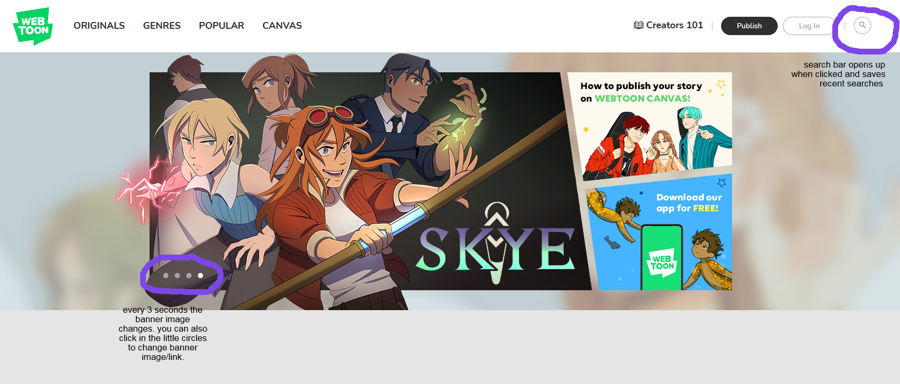
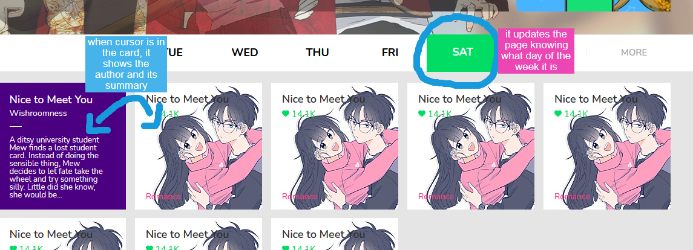

# Webtoon Site Remaking
  

 Trying to write webtoon's site. The original site is: <a href="https://www.webtoons.com/en/">Webtoon (EN)</a>.

## (09/12/2020) 

It has already:
<ul>
  <li>a header bar
  <li>research history (using browser's localStorage)
</ul>

## (10/12/2020) 

Done the banner part:

## (11/12/2020)

For some reason the margins didn't work like expected, so i just adjusted it.

Added:
  <ul>
    <li>Week-day bar that updates with clicks and with date
    <li>Started to do little pages.
  </ul>
  

